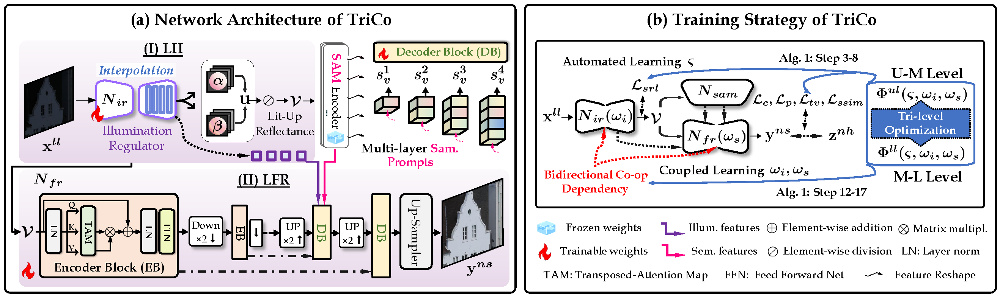
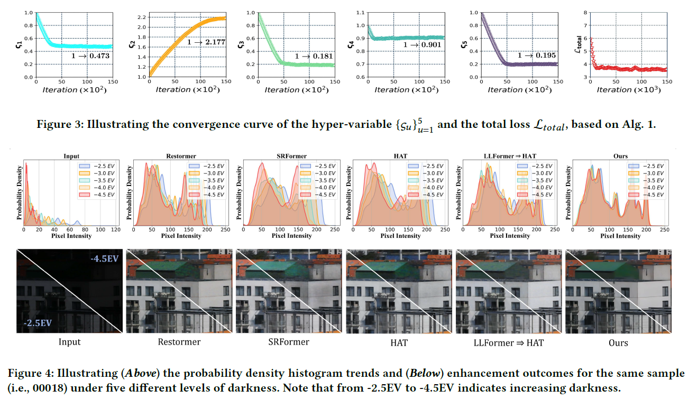

# [ACMMM 2024] Enhancing Images with Coupled Low-Resolution and Ultra-Dark Degradations: A Tri-level Learning Framework
By Jiaxin Gao and Yaohua Liu

## Pipeline
<p align="center">
    
</p>


## Dependencies
```
pip install -r requirements.txt
````


## Pre-trained Models 
You can download our pre-trained model from [[Google Drive]](https://drive.google.com/drive/folders/1m3t15rWw76IDDWJ0exLOe5P0uEnjk3zl?usp=drive_link) and [[Baidu Yun (extracted code:cjzk)]](https://pan.baidu.com/s/1fPLVgnZbdY1n75Flq54bMQ)

## How to train?
You need to modify ```datasets/dataset.py``` slightly for your environment, and then
```
python train.py  
```

## How to test?
```
python evaluate.py
```


## Results

- Benchmark Evaluation
<p align="center">
    
</p>

## Citation
If you use this code or ideas from the paper for your research, please cite our paper:
```
@inproceedings{gao2024enhancing,
  title={Enhancing Images with Coupled Low-Resolution and Ultra-Dark Degradations: A Tri-level Learning Framework},
  author={Gao, Jiaxin and Liu, Yaohua},
  booktitle={ACM Multimedia 2024}
}
```

## Acknowledgement
Part of the code is adapted from previous works: [Restormer](https://github.com/swz30/Restormer) and [MIRNet](https://github.com/swz30/MIRNet) (code structure). We thank all the authors for their contributions.

Please contact me if you have any questions at: jiaxinn.gao@outlook.com


